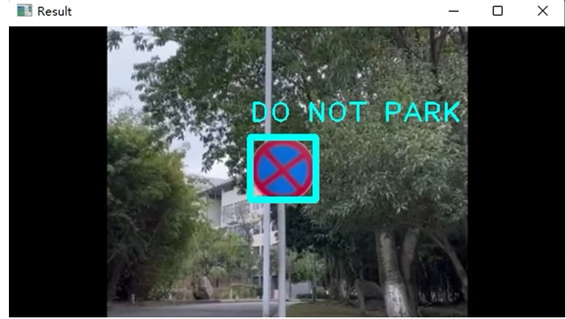
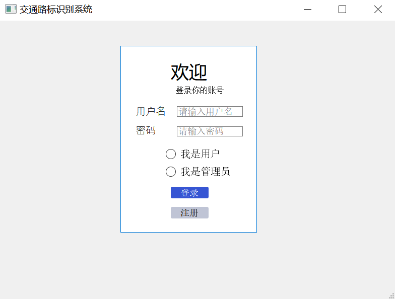
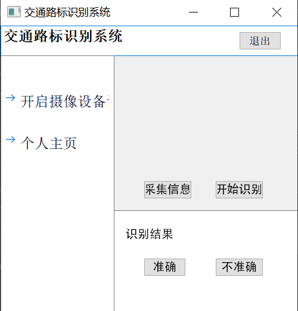

# Traffic-Sign-Recognition
Run this Python file to get the .exe of road sign recognition system.

## What each of these documents is doing? 
        | recognition_model_training  
          | my_model_SVM.m: model for road sign recognition system  
          | TSR_MachineLearning.ipynb:traing model by SVM  
          | 识别_.ipynb:process data.return bounding box and recognition result.  
        |ui  
          |hello.py:Login and Register interface.  
          |photo.py:using model to predict result.  
   
## How can you run your own code?
* Build your own database
* Modify the connection address of the relevant database in the code
* Run the hello.py

## Display  
  
  
  
  
